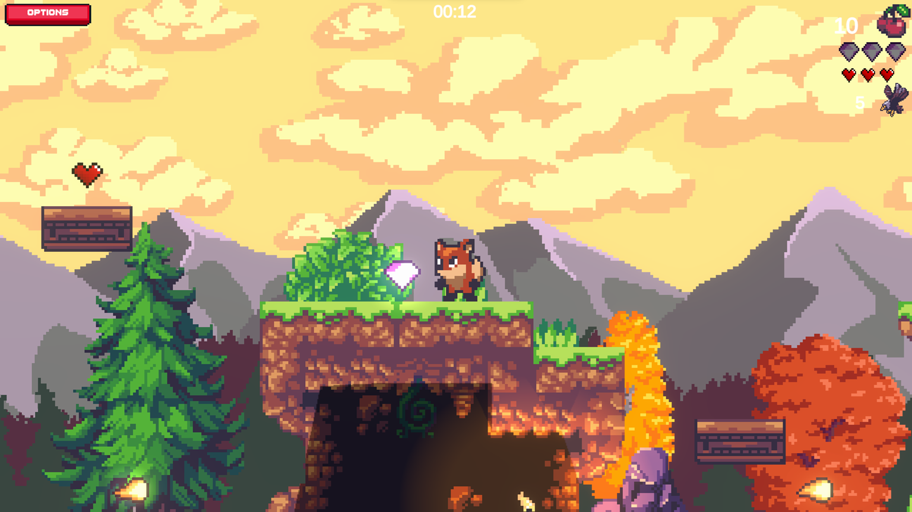
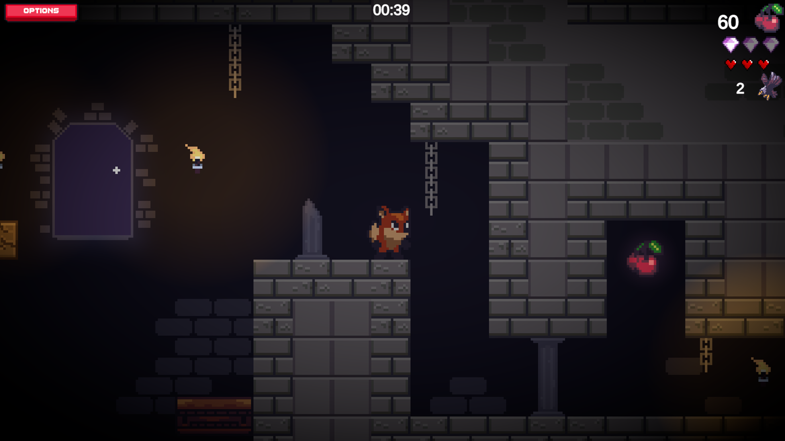
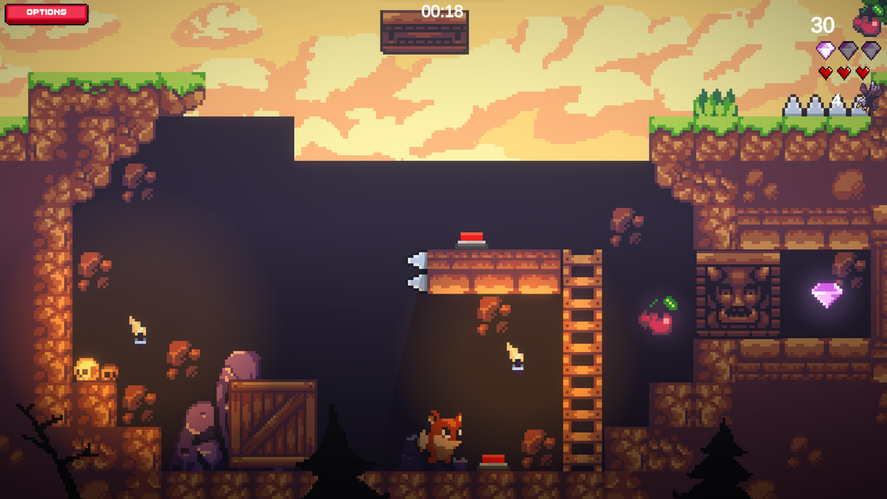

## How to play?

    Open the 'EXE' directory and run the '2D Platformer 1.exe' file.

### Controls

| Input | Action |
|------|--------|
| Hold **Space** or **LMB** | Control jump height |
| Double-tap **Space** or **LMB** | Double jump |
| **A** | Move left |
| **D** | Move right |
| **V** | Dash |
| **W / S / A / D**\* (before dashing) | Choose dash direction |

\* Hold up to two keys before pressing **V** to determine the direction of dashing, including diagonal.

## Demo video

[132.mp4](MEDIA/132.mp4)

## Screen shots

    
    
    
    

